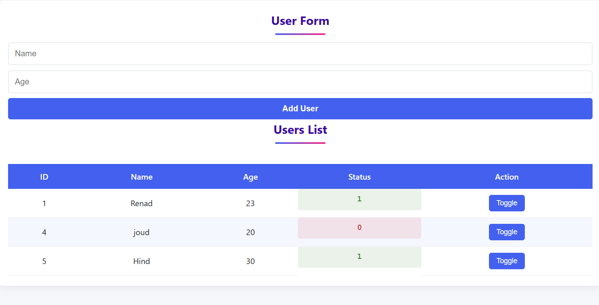
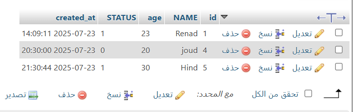

# 📝 Simple Info Form

A clean and creative web form to collect user information using **HTML + CSS + PHP + MySQL**. The form saves the data in a database and displays it in a neat table with live status updates.

---

## 📸 Screenshots

| Form Page | Database Table |
|-----------|----------------|
|  |  |

> Replace these with your actual screenshots (UI and phpMyAdmin view)

---

## 💡 Project Idea

This simple project allows users to:

- Enter their name, age, and status (0 or 1)
- Submit the data to a MySQL database
- View all records in a styled HTML table
- Change the status instantly using a toggle button

---

## 🧰 Tools Used

- HTML & CSS (custom styling)
- PHP (server-side processing)
- MySQL (database)
- XAMPP or WAMP (local server environment)

---

## 🚀 How to Run

1. Start **XAMPP** 
2. Move the project folder to the `htdocs` directory (for XAMPP)
3. Create the database:
   - Go to [localhost/phpmyadmin](http://localhost/phpmyadmin)
   - Create a new database called `infoform`
   - Run the following SQL query to create the table:
     ```sql
     CREATE TABLE users (
       id INT AUTO_INCREMENT PRIMARY KEY,
       name VARCHAR(100),
       age INT,
       status INT
     );
     ```
4. Open your browser and visit:
http://localhost/myproject/

---

## ✨ Notes

- Easily customize fonts and colors in `style.css`
- Table updates automatically after submitting the form
- The **Toggle** button changes user status between 0 and 1 using PHP

